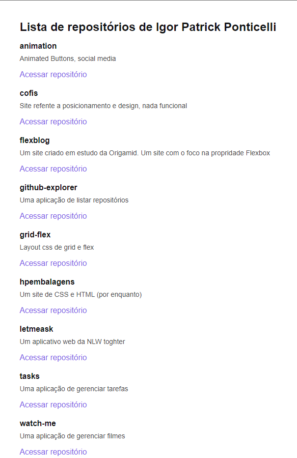

# github-explorer

<h2>Aplicação</h2>

Uma aplicação para listar os repositórios pela api do github.

---

<h4>Como rodar a aplicação?</h4>
<ol>
  <li>Necessário clonar o repositório "code" como preferir.</li>
  <li>Abrir a pasta no VsCode.</li>
  <li>Abrir o terminal e rodar a aplicação com "yarn dev".</li>
</ol>